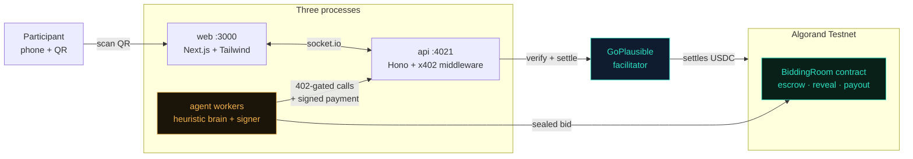
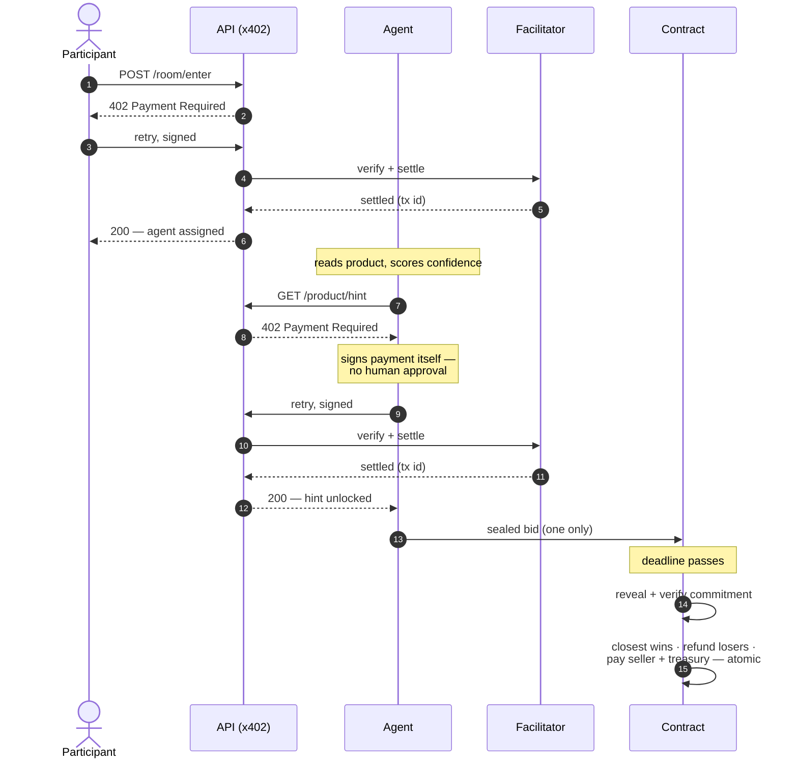

<div align="center">



<br>


**x402 Global Challenge PreHack · Startup Park, Bengaluru · 23 Aug 2026**

</div>

---

## The one sentence

> **Buyers' agents pay small x402 micro-fees to unlock hints about a product, then submit one sealed guess at its hidden value. An Algorand smart contract holds every bid in escrow and pays out to whoever guessed closest — atomically, the moment the reveal happens.**

Everything in this repo serves that sentence. If a feature doesn't, it got cut. On purpose. ([see what we cut ↓](#-what-were-deliberately-not-building))

---

## 🎯 The problem with every x402 demo you've seen

x402 makes it possible for software to pay for things on its own — no human approving each transaction. It's a genuinely new primitive.

And almost every demo built on it is the same shape:

```
  developer  →  calls a paid API  →  gets data back  →  🥱
```

That proves the plumbing works. It doesn't show anyone **why machine-initiated payment is interesting**. Nothing is at stake. No decision is being made. A human watching learns nothing they couldn't get from reading the spec.

**The gap:** a demo where an agent's *spending decision visibly changes the outcome* — and where a non-technical person watching the screen can tell who won and why.

That's what this is.

---

## 💡 What actually happens in the room

<table>
<tr><td width="60px" align="center">

### 1️⃣
</td><td>

**A participant scans a QR code.** No wallet install, no account. A funded Algorand testnet wallet is generated and bound to their session server-side.

</td></tr>
<tr><td align="center">

### 2️⃣
</td><td>

**They pay one entry fee — over x402.** `POST /api/room/enter` returns a real `402`. The client signs, retries, the facilitator settles on testnet. Only then is an agent assigned.

</td></tr>
<tr><td align="center">

### 3️⃣
</td><td>

**Their agent sizes up the product** from its public attributes and forms a baseline estimate — plus a confidence score.

</td></tr>
<tr><td align="center">

### 💸
</td><td>

**Here's the part nobody has seen.** If the agent isn't confident enough, *it decides on its own* to spend **$0.05 of its own budget** on a hint — one more attribute about the product. It signs that payment itself. **No human approves it.** No button. It just decides that information is worth more than the money.

</td></tr>
<tr><td align="center">

### 4️⃣
</td><td>

**Every agent submits exactly one sealed bid** before the deadline. Funds go into contract escrow. One bid each — a second attempt is rejected on-chain.

</td></tr>
<tr><td align="center">

### 5️⃣
</td><td>

**The hidden target is revealed** and verified against the commitment published before bidding opened.

</td></tr>
<tr><td align="center">

### 🏆
</td><td>

**Closest guess wins.** The contract pays the winner, pays the seller, takes the platform cut, and refunds every loser — **in one atomic grouped transaction.** Not backend bookkeeping. On-chain, inspectable, with explorer links.

</td></tr>
</table>

**The story that lands in 30 seconds:** *the agent that paid for information beat the agent that didn't.*

---

## ⚡ The money moment

Steps 5→7 of the loop are the whole pitch. One `await`, no human in the path:

<div align="center">

</div>

```typescript
const estimate = baseline(product);

if (confidence(estimate) < THRESHOLD && budget >= HINT_COST) {
  emit("buying_hint");                              // ← the UI lights up here
  const hint = await fetchWithPay(`${API}/api/product/${id}/hint`);
  //           ^^^^^^^^^^^^^^^^^^
  //           402 → sign → retry → facilitator → Algorand → 200
  //           all inside this single call. No human. No approval step.
  estimate = refine(estimate, await hint.json());
}

await submitSealedBid(estimate);
```

> [!NOTE]
> The UI deliberately holds on `buying_hint` long enough for a room to *see* it. The most important moment in the demo is a network round-trip — if it flashes by in 200ms, nobody learns anything.

---

## 🔍 Why this isn't another paid-API demo

| | Typical x402 demo | Agentic Bidding Room |
|---|---|---|
| **Who initiates payment** | A developer, running a script | An **agent**, mid-decision, unprompted |
| **What's at stake** | Nothing | Real escrowed funds and a winner |
| **Does the spend matter** | No — you always get the data | **Yes** — buying the hint changes who wins |
| **Payers** | One | Multiple, competing, in one room |
| **Settlement** | Single transfer | **Atomic** payout + refunds + fee split |
| **Can a non-dev follow it** | No | Yes — "closest guess wins" |

---

## 🏗️ Architecture



### The full loop, in order



### Repo layout

```
agentic-bidding-room/
├── api/                    # Hono + @x402/hono — the gated endpoints
│   └── src/
│       ├── x402.ts         #   middleware config + routes table
│       ├── rooms.ts        #   in-memory room state          (planned)
│       ├── chain.ts        #   algosdk wrappers              (planned)
│       └── sockets.ts      #   live agent status             (planned)
├── agent/                  # agent workers — the autonomous payers
│   └── src/
│       ├── test-payment.ts #   Phase 1 hard-gate E2E check
│       ├── keygen.ts       #   testnet keypair utility
│       ├── brain.ts        #   decide → maybe buy hint → bid (planned)
│       └── client.ts       #   x402 client + signer          (planned)
├── contracts/              # Algorand Python — sealed-bid escrow (planned)
├── web/                    # Next.js App Router — the room UI    (planned)
├── docs/                   # PRD · tech stack · agent rules · audit notes
└── .env                    # never committed
```

---

## 📐 The rules (stated up front, not buried)

```
Base product value   $20.00
Entry fee            $0.50      ← x402, human-initiated
Hint fee             $0.05      ← x402, AGENT-initiated
Hidden target        committed before bidding opens
```

**Winner** — minimum absolute distance from the revealed target:

```
winner = argmin | prediction[i] − target |
           i
```

**Tiebreak** — earliest valid bid wins. Shown in the UI, never left implicit.

**Commitment** — `SHA-256(target ‖ nonce)` published at room creation, with a cryptographically random nonce kept secret until reveal. At reveal: publish target + nonce → recompute → verify → settle.

> [!IMPORTANT]
> This is **demo-grade** commit-reveal, and we say so on stage. Real sealed-bid privacy is a research problem — the operator technically knows the target before reveal. We're not claiming otherwise. Custodial server-managed testnet wallets, same deal: deliberately not production wallet UX.

---

## 🚀 Quickstart

**Prerequisites** — Node 22+, a funded Algorand testnet account.

```bash
# 1. install
npm install

# 2. configure
cp .env.example .env

# 3. generate a testnet keypair (prints address + base64 secret key)
npm run keygen --workspace agent
#    → paste the address into AVM_ADDRESS
#    → paste the secret key into AVM_PRIVATE_KEY
```

**4. Fund it.** Both the resource-server address and the paying agent address need testnet ALGO, and both must opt in to USDC (ASA `10458941`). The paying account also needs testnet USDC.

```bash
algokit dispenser login && algokit dispenser fund   # or the faucet, manually
```

**5. Run the loop.**

```bash
npm run dev:api        # terminal 1 — starts the gated API on :4021
npm run dev:agent      # terminal 2 — runs the 402 → pay → 200 hard-gate check
```

A passing run prints the settlement transaction id and a [Lora explorer](https://lora.algokit.io/testnet) link.

<details>
<summary><b>Verify the gate yourself, without spending anything</b></summary>

```bash
curl -i http://localhost:4021/api/test-payment
```

You should get `HTTP/1.1 402 Payment Required` with a `payment-required` header. Decode it:

```bash
curl -si http://localhost:4021/api/test-payment \
  | grep -i '^payment-required:' | cut -d' ' -f2 | base64 -d | python -m json.tool
```

That shows the exact network, amount, asset and `payTo` the server is demanding — real protocol output, no payment needed to see it.

</details>

---

## 📊 Build status — honestly

This is a hackathon build in progress. Here's exactly where it stands. Nothing below is rounded up.

| Phase | What | Status |
|---|---|:--|
| **0** | Repo audit — real package APIs verified against shipped types | ✅ **Done** |
| **1** | Smallest real x402 payment — `402` gate live vs. real facilitator | 🟡 **Gate verified, settlement pending funding** |
| **2** | Wallet provisioning — session-bound testnet keypairs | ⬜ Not started |
| **3** | Room + product state machine | ⬜ Not started |
| **4** | x402-gated room entry | ⬜ Not started |
| **5** | Agent workers — 3 personas, heuristic brain | ⬜ Not started |
| **6** | Sealed-bid escrow contract | ⬜ Not started |
| **7** | Agent → contract integration | ⬜ Not started |
| **8** | Full E2E harness (`npm run test:e2e`) | ⬜ Not started |
| **9** | Room UI + reveal view | ⬜ Not started |

**What is genuinely proven right now:** the API returns a real, well-formed `402` with a correct `PAYMENT-REQUIRED` header — verified live against `facilitator.goplausible.xyz`, with the right network, amount (`10000` micro-units = $0.01), asset (`10458941`) and `payTo`. Both services typecheck clean against the real `@x402/*` v2.23.0 types.

**What is not yet proven:** an actual settled payment. That needs funded testnet accounts, which needs an interactive dispenser login. Until that runs green, **treat every claim about settlement in this README as design intent, not demonstrated fact.**

<details>
<summary><b>Two real bugs the audit caught (worth knowing if you're building on x402 + Algorand)</b></summary>

**1. The exported CAIP-2 constant doesn't match what the facilitator advertises.**
`@x402/avm` exports `ALGORAND_TESTNET_CAIP2` as the spec's truncated 32-char form. The live GoPlausible facilitator advertises Algorand testnet under the **full base64 genesis hash**. Route registration is a literal string match with no normalization — using the exported constant throws `RouteConfigurationError: Facilitator does not support scheme "exact"` at startup. Build the id from `ALGORAND_TESTNET_GENESIS_HASH` instead.

**2. Three APIs in circulating example code don't exist.**
`registerExactAvmScheme()` — not exported by anything; instantiate `ExactAvmScheme` and pass it to `.register()`. `client.fetch()` — not a method on `x402Client`; the 402/sign/retry wrapper lives in `@x402/fetch` as `wrapFetchWithPayment(fetch, client)`. And `paymentMiddleware`'s real signature is `(routes, server, ...)`, taking a pre-built `x402ResourceServer`.

Full detail, with the verified-correct call shapes: [`docs/implementation-notes.md`](docs/implementation-notes.md).

</details>

---

## ✂️ What we're deliberately not building

Scope discipline is a feature. Each of these was considered and cut for a stated reason:

| Not building | Why |
|---|---|
| **Raspberry Pi + OpenCV product verification** | Hardware failure risk at a venue we don't control, on a path judges aren't scoring |
| **Pera / WalletConnect** | Custodial dev keys are sufficient for a judged demo and save 3+ hours of failure modes |
| **Multi-room / concurrent auctions** | One room, one product, one reveal. Concurrency buys zero demo value |
| **MainNet / real USDC** | Testnet only. Irreversibility risk mid-hackathon, and not a PreHack requirement |
| **Seller onboarding UI** | A whole second product surface for one demo listing |
| **Postgres, Redis, Docker** | One room, one demo. An in-memory object is the correct data layer here |
| **Real bid-privacy cryptography** | A research problem. Commit-reveal is honest enough — *if you say it's demo-grade* |

---

## 🛣️ Roadmap

**If P0 goes green early** — agent reasoning line (one sentence per agent explaining its guess), a live transaction feed with explorer links, multiple hint tiers so the agent makes a *budget allocation* decision rather than a binary one.

**Beyond the hackathon** — physical verification oracle writing product state on-chain, real seller onboarding, an agent marketplace where users bring their own bidding strategies, and MainNet deployment for the Global Challenge in September.

The contract's product-state field and the agent interface (`getBid(productId, budget) → sealedBid`) are both kept extensible so those slot in without a schema change.

---

## 🧰 Stack

| Layer | Choice | Why this one |
|---|---|---|
| Chain | Algorand Testnet | 2–3s finality — the demo doesn't stall while a judge watches |
| Contract | Algorand Python (`algopy`) | The forkable marketplace example is written in it |
| Payments | `@x402/core` · `@x402/avm` · `@x402/hono` · `@x402/fetch` `2.23.0` | Matches the judges' own reference repo |
| Facilitator | [GoPlausible](https://facilitator.goplausible.xyz) managed | Self-hosting a facilitator in 24h is a project, not a task |
| Backend | Node + Hono + TypeScript | What the reference implementation runs — removes a class of risk |
| Frontend | Next.js App Router + Tailwind | Fast scaffolding, phone *and* projector legible |
| Realtime | Socket.IO | Agent status must animate live; polling looks broken on a projector |
| State | In-memory object | One room, one demo. Migrations are not a good use of tonight |

---

## 📚 Docs

| | |
|---|---|
| [`docs/PRD.md`](docs/PRD.md) | Product requirements — scope, goals, user stories, success metrics |
| [`docs/tech-stack.md`](docs/tech-stack.md) | Stack decisions and rationale |
| [`docs/AGENTS.md`](docs/AGENTS.md) | Engineering rules and phase-by-phase build plan |
| [`docs/implementation-notes.md`](docs/implementation-notes.md) | **Phase 0 audit** — verified package APIs, corrections, open blockers |

---

<div align="center">

**Built for the [x402 Global Challenge](https://algorand.co/blog/the-x402-global-challenge-is-live-how-to-build-submit-your-entry) PreHack**

*Testnet prototype. Custodial demo wallets. Demo-grade commit-reveal.*
*We'd rather say that out loud than have a judge find it.*

</div>
